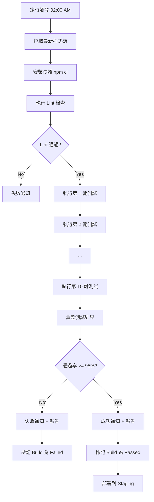
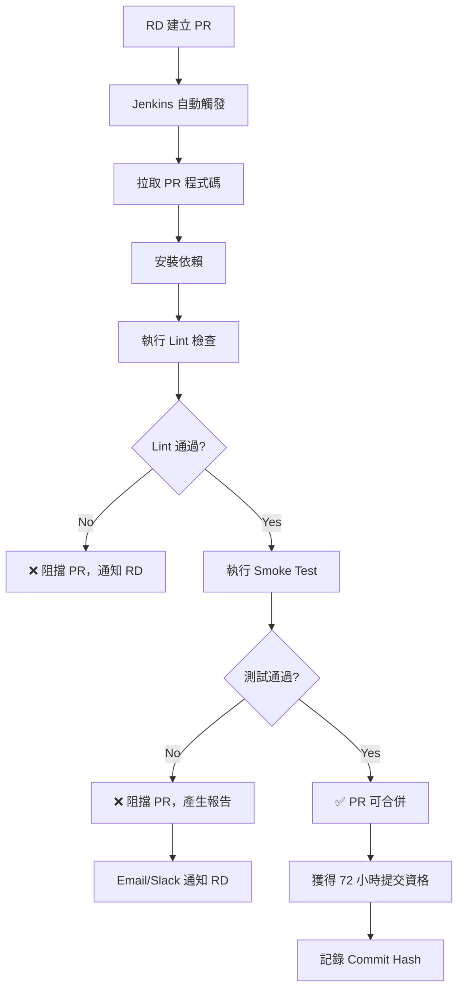
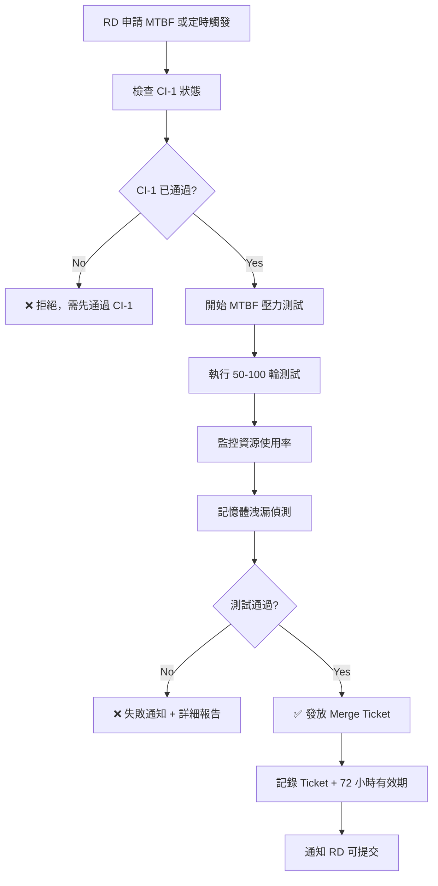
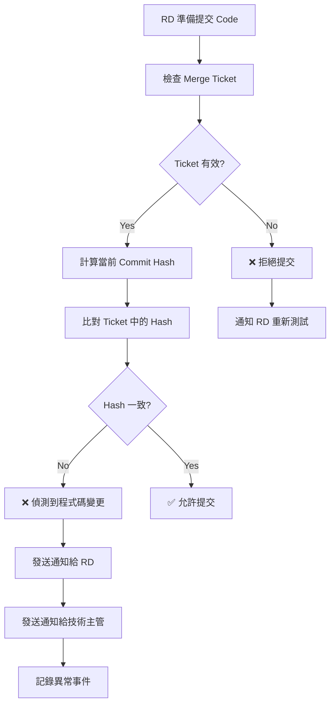

# Dogcatstar E2E CI/CD 整合計畫
**Continuous Integration & Continuous Deployment Plan**

---

## 📋 文件資訊

- **專案名稱**: Dogcatstar E2E Web Test Plan
- **文件版本**: 1.0
- **撰寫日期**: 2025-10-29
- **負責人**: Howie / QA Team
- **最後更新**: 2025-10-29

---

## 🎯 CI/CD 目標

本 CI/CD 計畫旨在建立多層次的自動化測試與品質關卡，確保：

1. ✅ **程式碼品質管控**：RD 提交前必須通過測試驗證
2. ✅ **持續回歸測試**：每日自動化回歸測試，確保系統穩定
3. ✅ **壓力測試驗證**：MTBF（Mean Time Between Failures）壓力測試
4. ✅ **版本追蹤機制**：程式碼變更自動偵測與通知
5. ✅ **報告自動產出**：測試結果、錯誤追蹤、覆蓋率報告

---

## 🏗️ CI/CD 架構總覽

### 三階段驗證流程

```
┌─────────────────────────────────────────────────────────────────┐
│                        CI/CD Pipeline                            │
└─────────────────────────────────────────────────────────────────┘

   RD 開發完成
        ↓
   ┌─────────────────────┐
   │   CI-1: Pre-Commit  │  ← 部分回歸測試（重要測項）
   │   Gate Check        │  ← 快速驗證（約 15-30 分鐘）
   └─────────────────────┘
        ↓ PASS
   ┌─────────────────────┐
   │  獲得提交資格        │  ← 72 小時有效期限
   └─────────────────────┘
        ↓
   ┌─────────────────────┐
   │  CI-MTBF: 壓力測試   │  ← 每天 1-2 班次
   │  Mean Time Between  │  ← 長時間穩定性驗證
   │  Failures Testing   │
   └─────────────────────┘
        ↓ PASS
   ┌─────────────────────┐
   │  獲得 Merge Ticket  │  ← 72 小時有效期限
   └─────────────────────┘
        ↓
   RD 決定提交時機
        ↓
   ┌─────────────────────┐
   │  版控變更偵測        │  ← 檢查程式碼是否被修改
   └─────────────────────┘
        ↓ 無變更
   ┌─────────────────────┐
   │  Code Merge         │  ← 合併到 main/develop
   └─────────────────────┘
        ↓
   ┌─────────────────────┐
   │  CI-0: Internal     │  ← 每日 10 輪全回歸測試
   │  Verification       │  ← 02:00 AM 執行
   │  (Nightly Build)    │  ← 100% 測試覆蓋率
   └─────────────────────┘
        ↓ PASS
   ┌─────────────────────┐
   │  Deploy to Staging  │  ← 部署到測試環境
   └─────────────────────┘
        ↓
   ┌─────────────────────┐
   │  UAT Verification   │  ← PM/Stakeholder 驗收
   └─────────────────────┘
        ↓ PASS
   ┌─────────────────────┐
   │  Deploy to Prod     │  ← 部署到正式環境
   └─────────────────────┘
```

---

## 📊 CI-0: Internal Verification（內部驗證）

### 目的
每日自動化全回歸測試，確保系統整體穩定性與品質。

### 觸發時機
- **定時觸發**: 每日凌晨 02:00 AM 自動執行
- **手動觸發**: QA/RD 可手動觸發測試
- **Code Merge 後**: RD 提交程式碼合併後自動觸發

### 測試範圍
- ✅ **100% 測試案例覆蓋率**
  - 購物車功能（5 個測試案例）
  - 登入功能（4 個自動化 + 5 個手動）
  - 購物車 API（8 個測試案例）
  - 認證 API（4 個測試案例）
- ✅ **壓力測試**
  - 10 輪連續執行（測試穩定性）
  - 模擬高併發情境（可選）
  - 記憶體洩漏檢測（可選）

### 執行流程



### Jenkins Pipeline 設定

```groovy
pipeline {
  agent any
  
  triggers {
    // 每日凌晨 2:00 觸發
    cron('0 2 * * *')
  }
  
  environment {
    NODE_ENV = 'test'
    PLAYWRIGHT_BROWSERS_PATH = '0'
  }
  
  stages {
    stage('Checkout') {
      steps {
        echo '📥 拉取最新程式碼...'
        checkout scm
      }
    }
    
    stage('Install Dependencies') {
      steps {
        echo '📦 安裝依賴套件...'
        sh 'npm ci'
        sh 'npx playwright install --with-deps chromium'
      }
    }
    
    stage('Lint Check') {
      steps {
        echo '🔍 執行 Lint 檢查...'
        sh 'npm run lint || exit 0'
      }
    }
    
    stage('CI-0: 10 輪全回歸測試') {
      steps {
        echo '🔄 開始執行 10 輪自動化測試...'
        script {
          def passCount = 0
          def failCount = 0
          
          for (int i = 1; i <= 10; i++) {
            echo "🚀 執行第 ${i} 輪測試..."
            def result = sh(
              script: 'npx playwright test --workers=1 --retries=0',
              returnStatus: true
            )
            
            if (result == 0) {
              passCount++
              echo "✅ 第 ${i} 輪測試通過"
            } else {
              failCount++
              echo "❌ 第 ${i} 輪測試失敗"
            }
          }
          
          def passRate = (passCount / 10) * 100
          echo "📊 測試通過率: ${passRate}%"
          
          if (passRate < 95) {
            error("❌ 通過率未達標 (${passRate}% < 95%)")
          }
        }
      }
    }
    
    stage('Generate Report') {
      steps {
        echo '📄 產生測試報告...'
        sh 'npx playwright show-report'
      }
    }
    
    stage('Archive Artifacts') {
      steps {
        echo '📦 歸檔測試報告...'
        archiveArtifacts artifacts: 'playwright-report/**', fingerprint: true
        archiveArtifacts artifacts: 'test-results/**', fingerprint: true
      }
    }
  }
  
  post {
    always {
      echo '📧 發送測試結果通知...'
      // 發送 Email/Slack 通知
      script {
        def status = currentBuild.result ?: 'SUCCESS'
        def color = status == 'SUCCESS' ? 'good' : 'danger'
        def message = """
          *CI-0 內部驗證結果*
          - 狀態: ${status}
          - Build #${BUILD_NUMBER}
          - 分支: ${BRANCH_NAME}
          - 報告: ${BUILD_URL}artifact/playwright-report/index.html
        """
        
        // Slack 通知（需安裝 Slack Plugin）
        slackSend(color: color, message: message)
        
        // Email 通知
        emailext(
          subject: "[CI-0] 每日回歸測試結果 - ${status}",
          body: message,
          to: 'qa-team@dogcatstar.com, rd-team@dogcatstar.com'
        )
      }
    }
    
    success {
      echo '✅ CI-0 驗證通過，可部署到 Staging'
    }
    
    failure {
      echo '❌ CI-0 驗證失敗，請檢查測試報告'
    }
  }
}
```

### 產出報告
1. **Playwright HTML 報告**
   - 路徑: `playwright-report/index.html`
   - 內容: 測試執行結果、截圖、錯誤訊息

2. **每輪測試統計**
   - 通過率統計（10 輪）
   - 失敗測試案例列表
   - 執行時間分析

3. **趨勢報告**
   - 每日通過率趨勢圖
   - 失敗案例統計
   - 平均執行時間

---

## 🚦 CI-1: Pre-Commit Gate Check（提交前驗證）

### 目的
RD 提交程式碼前的快速驗證，確保不會合併有問題的程式碼。

### 觸發時機
- **RD 建立 Pull Request (PR)** 時自動觸發
- **RD push 到 feature branch** 時自動觸發

### 測試範圍
- ✅ **重要測項（Smoke Test）**
  - 標記 `@smoke` 或 `@critical` 的測試案例
  - 購物車核心功能（TC-CART-0001, 0002, 0005）
  - 登入核心功能（TC-LOGIN-0001, 0004）
  - API 認證測試（TC-API-AUTH-001, 002）
- ✅ **快速執行**
  - 預計 15-30 分鐘內完成
  - 使用 `--workers=2` 加速執行

### 執行流程



### Jenkins Pipeline 設定

```groovy
pipeline {
  agent any
  
  environment {
    NODE_ENV = 'test'
    PR_NUMBER = "${env.CHANGE_ID}"
    COMMIT_HASH = "${env.GIT_COMMIT}"
  }
  
  stages {
    stage('Checkout PR') {
      steps {
        echo "📥 拉取 PR #${PR_NUMBER} 程式碼..."
        checkout scm
      }
    }
    
    stage('Install Dependencies') {
      steps {
        echo '📦 安裝依賴套件...'
        sh 'npm ci'
        sh 'npx playwright install --with-deps chromium'
      }
    }
    
    stage('Lint Check') {
      steps {
        echo '🔍 執行 Lint 檢查...'
        sh 'npm run lint'
      }
    }
    
    stage('CI-1: Smoke Test') {
      steps {
        echo '🚀 執行重要測項驗證...'
        sh 'npx playwright test --grep "@smoke" --workers=2 --retries=1'
      }
    }
    
    stage('Generate Report') {
      steps {
        echo '📄 產生測試報告...'
        sh 'npx playwright show-report'
      }
    }
    
    stage('Record Commit Hash') {
      when {
        expression { currentBuild.result == null || currentBuild.result == 'SUCCESS' }
      }
      steps {
        echo '📝 記錄 Commit Hash 與有效期限...'
        script {
          def expiryTime = new Date(System.currentTimeMillis() + 72 * 60 * 60 * 1000)
          writeFile(
            file: "ci-1-approval-${PR_NUMBER}.json",
            text: """
              {
                "pr_number": "${PR_NUMBER}",
                "commit_hash": "${COMMIT_HASH}",
                "approval_time": "${new Date()}",
                "expiry_time": "${expiryTime}",
                "status": "APPROVED"
              }
            """
          )
          archiveArtifacts artifacts: "ci-1-approval-${PR_NUMBER}.json"
        }
      }
    }
  }
  
  post {
    success {
      echo '✅ CI-1 驗證通過，RD 可選擇進入 CI-MTBF 或直接提交'
      script {
        def expiryTime = new Date(System.currentTimeMillis() + 72 * 60 * 60 * 1000)
        def message = """
          *CI-1 驗證通過* ✅
          - PR #${PR_NUMBER}
          - Commit: ${COMMIT_HASH}
          - 有效期限: ${expiryTime}
          - 選項 1: 進入 CI-MTBF 壓力測試
          - 選項 2: 72 小時內直接提交
          - 報告: ${BUILD_URL}artifact/playwright-report/index.html
        """
        
        slackSend(color: 'good', message: message)
        emailext(
          subject: "[CI-1] PR #${PR_NUMBER} 驗證通過",
          body: message,
          to: '${CHANGE_AUTHOR_EMAIL}'
        )
      }
    }
    
    failure {
      echo '❌ CI-1 驗證失敗，阻擋 PR 合併'
      script {
        def message = """
          *CI-1 驗證失敗* ❌
          - PR #${PR_NUMBER}
          - Commit: ${COMMIT_HASH}
          - 請修正測試失敗項目後重新提交
          - 報告: ${BUILD_URL}artifact/playwright-report/index.html
        """
        
        slackSend(color: 'danger', message: message)
        emailext(
          subject: "[CI-1] PR #${PR_NUMBER} 驗證失敗",
          body: message,
          to: '${CHANGE_AUTHOR_EMAIL}'
        )
      }
    }
    
    always {
      archiveArtifacts artifacts: 'playwright-report/**', fingerprint: true
    }
  }
}
```

### 產出報告
1. **快速驗證報告**
   - Smoke Test 執行結果
   - 失敗案例詳細資訊
   - 執行時間統計

2. **提交資格憑證**
   - Commit Hash 記錄
   - 有效期限（72 小時）
   - 審核狀態

---

## 🔥 CI-MTBF: 壓力測試（Mean Time Between Failures）

### 目的
長時間穩定性驗證，確保程式碼在高負載、長時間運行下不會出現問題。

### 觸發時機
- **RD 主動申請**: CI-1 通過後，RD 可選擇進入 MTBF
- **定時執行**: 每天 1-2 班次（如 10:00、16:00）

### 測試範圍
- ✅ **長時間穩定性測試**
  - 連續執行 50-100 次（可調整）
  - 記憶體洩漏偵測
  - 資源使用率監控
- ✅ **壓力測試情境**
  - 模擬高併發（多 worker）
  - 資料庫連線壓力
  - API 回應時間監控

### 執行流程



### Jenkins Pipeline 設定

```groovy
pipeline {
  agent any
  
  parameters {
    string(name: 'PR_NUMBER', description: 'PR 編號')
    string(name: 'COMMIT_HASH', description: 'Commit Hash')
    choice(name: 'TEST_ROUNDS', choices: ['50', '100', '150'], description: '測試輪數')
  }
  
  environment {
    NODE_ENV = 'test'
  }
  
  stages {
    stage('Verify CI-1 Status') {
      steps {
        echo '🔍 驗證 CI-1 狀態...'
        script {
          def approvalFile = "ci-1-approval-${params.PR_NUMBER}.json"
          if (!fileExists(approvalFile)) {
            error('❌ 未找到 CI-1 審核記錄，請先通過 CI-1')
          }
          
          def approval = readJSON file: approvalFile
          if (approval.commit_hash != params.COMMIT_HASH) {
            error('❌ Commit Hash 不符，請重新執行 CI-1')
          }
          
          def expiryTime = new Date(approval.expiry_time)
          if (new Date() > expiryTime) {
            error('❌ CI-1 審核已過期，請重新執行')
          }
        }
      }
    }
    
    stage('Checkout') {
      steps {
        echo '📥 拉取程式碼...'
        checkout scm
        sh "git checkout ${params.COMMIT_HASH}"
      }
    }
    
    stage('Install Dependencies') {
      steps {
        echo '📦 安裝依賴套件...'
        sh 'npm ci'
        sh 'npx playwright install --with-deps chromium'
      }
    }
    
    stage('CI-MTBF: 壓力測試') {
      steps {
        echo "🔥 開始執行 ${params.TEST_ROUNDS} 輪壓力測試..."
        script {
          def passCount = 0
          def failCount = 0
          def memoryLeaks = []
          
          for (int i = 1; i <= params.TEST_ROUNDS.toInteger(); i++) {
            echo "🚀 執行第 ${i} 輪測試..."
            
            // 記錄記憶體使用
            def memBefore = sh(
              script: 'free -m | grep Mem | awk \'{print $3}\'',
              returnStdout: true
            ).trim()
            
            // 執行測試
            def result = sh(
              script: 'npx playwright test --workers=2 --retries=0',
              returnStatus: true
            )
            
            // 檢查記憶體
            def memAfter = sh(
              script: 'free -m | grep Mem | awk \'{print $3}\'',
              returnStdout: true
            ).trim()
            
            def memDiff = memAfter.toInteger() - memBefore.toInteger()
            if (memDiff > 100) {
              memoryLeaks.add("Round ${i}: +${memDiff}MB")
            }
            
            if (result == 0) {
              passCount++
              echo "✅ 第 ${i} 輪測試通過"
            } else {
              failCount++
              echo "❌ 第 ${i} 輪測試失敗"
            }
            
            // 每 10 輪輸出統計
            if (i % 10 == 0) {
              def currentPassRate = (passCount / i) * 100
              echo "📊 目前通過率: ${currentPassRate}% (${passCount}/${i})"
            }
          }
          
          def passRate = (passCount / params.TEST_ROUNDS.toInteger()) * 100
          echo "📊 最終通過率: ${passRate}%"
          
          if (memoryLeaks.size() > 0) {
            echo "⚠️  偵測到記憶體洩漏: ${memoryLeaks}"
          }
          
          if (passRate < 98) {
            error("❌ 通過率未達標 (${passRate}% < 98%)")
          }
          
          if (memoryLeaks.size() > 10) {
            error("❌ 記憶體洩漏次數過多 (${memoryLeaks.size()} > 10)")
          }
        }
      }
    }
    
    stage('Issue Merge Ticket') {
      when {
        expression { currentBuild.result == null || currentBuild.result == 'SUCCESS' }
      }
      steps {
        echo '🎫 發放 Merge Ticket...'
        script {
          def expiryTime = new Date(System.currentTimeMillis() + 72 * 60 * 60 * 1000)
          def ticketId = "MTBF-${params.PR_NUMBER}-${BUILD_NUMBER}"
          
          writeFile(
            file: "merge-ticket-${ticketId}.json",
            text: """
              {
                "ticket_id": "${ticketId}",
                "pr_number": "${params.PR_NUMBER}",
                "commit_hash": "${params.COMMIT_HASH}",
                "test_rounds": ${params.TEST_ROUNDS},
                "pass_rate": "98%+",
                "issue_time": "${new Date()}",
                "expiry_time": "${expiryTime}",
                "status": "VALID"
              }
            """
          )
          archiveArtifacts artifacts: "merge-ticket-${ticketId}.json"
        }
      }
    }
  }
  
  post {
    success {
      echo '✅ CI-MTBF 通過，發放 Merge Ticket'
      script {
        def expiryTime = new Date(System.currentTimeMillis() + 72 * 60 * 60 * 1000)
        def message = """
          *CI-MTBF 壓力測試通過* ✅
          - PR #${params.PR_NUMBER}
          - Commit: ${params.COMMIT_HASH}
          - 測試輪數: ${params.TEST_ROUNDS}
          - Merge Ticket 有效期限: ${expiryTime}
          - RD 可在 72 小時內選擇提交時機
          - 報告: ${BUILD_URL}artifact/playwright-report/index.html
        """
        
        slackSend(color: 'good', message: message)
        emailext(
          subject: "[CI-MTBF] PR #${params.PR_NUMBER} 壓力測試通過",
          body: message,
          to: '${CHANGE_AUTHOR_EMAIL}'
        )
      }
    }
    
    failure {
      echo '❌ CI-MTBF 失敗'
      script {
        def message = """
          *CI-MTBF 壓力測試失敗* ❌
          - PR #${params.PR_NUMBER}
          - Commit: ${params.COMMIT_HASH}
          - 測試輪數: ${params.TEST_ROUNDS}
          - 請檢查報告並修正問題
          - 報告: ${BUILD_URL}artifact/playwright-report/index.html
        """
        
        slackSend(color: 'danger', message: message)
        emailext(
          subject: "[CI-MTBF] PR #${params.PR_NUMBER} 壓力測試失敗",
          body: message,
          to: '${CHANGE_AUTHOR_EMAIL}, tech-lead@dogcatstar.com'
        )
      }
    }
    
    always {
      archiveArtifacts artifacts: 'playwright-report/**', fingerprint: true
      archiveArtifacts artifacts: 'test-results/**', fingerprint: true
    }
  }
}
```

### 產出報告
1. **壓力測試報告**
   - 測試輪數與通過率
   - 記憶體使用趨勢圖
   - 失敗案例分析

2. **Merge Ticket**
   - Ticket ID
   - 有效期限（72 小時）
   - 測試通過證明

---

## 🔒 版控變更偵測機制

### 目的
確保 RD 提交的程式碼與通過 CI-1/MTBF 時的版本一致，避免繞過測試。

### 觸發時機
- **RD 執行 Git Merge/Push** 時自動檢查

### 檢查流程



### Git Pre-Merge Hook 腳本

```bash
#!/bin/bash
# .git/hooks/pre-merge (需設定為可執行)

PR_NUMBER=$1
CURRENT_COMMIT=$(git rev-parse HEAD)

echo "🔍 檢查 Merge Ticket..."

# 尋找對應的 Merge Ticket
TICKET_FILE=$(find . -name "merge-ticket-MTBF-${PR_NUMBER}-*.json" | head -n 1)

if [ -z "$TICKET_FILE" ]; then
  echo "❌ 錯誤: 未找到有效的 Merge Ticket"
  echo "請先通過 CI-1 或 CI-MTBF 測試"
  exit 1
fi

# 讀取 Ticket 資訊
TICKET_HASH=$(jq -r '.commit_hash' "$TICKET_FILE")
EXPIRY_TIME=$(jq -r '.expiry_time' "$TICKET_FILE")

# 檢查 Hash 是否一致
if [ "$CURRENT_COMMIT" != "$TICKET_HASH" ]; then
  echo "❌ 錯誤: 程式碼已被修改"
  echo "Ticket Commit: $TICKET_HASH"
  echo "Current Commit: $CURRENT_COMMIT"
  echo ""
  echo "偵測到程式碼變更，將通知 RD 與技術主管..."
  
  # 發送通知
  curl -X POST https://your-notification-service.com/alert \
    -H "Content-Type: application/json" \
    -d "{
      \"type\": \"CODE_CHANGE_DETECTED\",
      \"pr_number\": \"$PR_NUMBER\",
      \"ticket_hash\": \"$TICKET_HASH\",
      \"current_hash\": \"$CURRENT_COMMIT\",
      \"author\": \"$(git log -1 --pretty=format:'%ae')\",
      \"notify\": [\"rd-team@dogcatstar.com\", \"tech-lead@dogcatstar.com\"]
    }"
  
  exit 1
fi

# 檢查有效期限
CURRENT_TIME=$(date -u +"%Y-%m-%dT%H:%M:%S")
if [[ "$CURRENT_TIME" > "$EXPIRY_TIME" ]]; then
  echo "❌ 錯誤: Merge Ticket 已過期"
  echo "過期時間: $EXPIRY_TIME"
  echo "請重新執行 CI-1 或 CI-MTBF"
  exit 1
fi

echo "✅ 驗證通過，允許提交"
exit 0
```

### Jenkins 版控檢查 Pipeline

```groovy
stage('Verify Code Integrity') {
  steps {
    echo '🔍 檢查程式碼完整性...'
    script {
      def ticketFile = "merge-ticket-MTBF-${PR_NUMBER}-*.json"
      def ticket = readJSON file: ticketFile
      
      def currentHash = sh(
        script: 'git rev-parse HEAD',
        returnStdout: true
      ).trim()
      
      if (currentHash != ticket.commit_hash) {
        def message = """
          *⚠️  程式碼變更警告*
          - PR #${PR_NUMBER}
          - Ticket Commit: ${ticket.commit_hash}
          - Current Commit: ${currentHash}
          - 偵測到程式碼在測試後被修改
          - RD: ${env.CHANGE_AUTHOR}
          - 請重新執行 CI-1/MTBF 測試
        """
        
        // 通知 RD
        emailext(
          subject: "[警告] PR #${PR_NUMBER} 程式碼已變更",
          body: message,
          to: '${CHANGE_AUTHOR_EMAIL}'
        )
        
        // 通知技術主管
        emailext(
          subject: "[警告] PR #${PR_NUMBER} 程式碼已變更",
          body: message,
          to: 'tech-lead@dogcatstar.com'
        )
        
        // Slack 通知
        slackSend(color: 'warning', message: message)
        
        error('程式碼已變更，需重新測試')
      }
    }
  }
}
```

---

## 📊 報告機制

### 1. 測試執行報告

#### Playwright HTML 報告
- **路徑**: `playwright-report/index.html`
- **內容**:
  - 測試案例執行結果
  - 失敗案例截圖
  - 錯誤訊息與 Stack Trace
  - 執行時間統計

#### JSON 格式報告
```json
{
  "build_number": 123,
  "ci_stage": "CI-0",
  "date": "2025-10-29T02:00:00Z",
  "total_tests": 50,
  "passed": 48,
  "failed": 2,
  "pass_rate": 96,
  "duration_seconds": 1800,
  "failed_tests": [
    {
      "test_id": "TC-CART-0003",
      "error": "Timeout waiting for cart icon",
      "screenshot": "test-results/cart-003-failure.png"
    }
  ]
}
```

### 2. 每日趨勢報告

#### Jenkins 趨勢圖
- 使用 Jenkins Plot Plugin
- 記錄每日通過率
- 失敗案例趨勢
- 平均執行時間

#### 產生方式
```groovy
post {
  always {
    plot(
      csvFileName: 'trend-report.csv',
      group: 'CI-0 Trends',
      style: 'line',
      title: '每日測試通過率',
      yaxis: 'Pass Rate (%)',
      series: [[
        file: 'test-results/pass-rate.csv',
        displayTableFlag: true
      ]]
    )
  }
}
```

### 3. 失敗分析報告

#### 自動產生失敗分析
```javascript
// generate-failure-report.js
const fs = require('fs');
const results = require('./test-results.json');

const failedTests = results.failed_tests.map(test => ({
  id: test.test_id,
  name: test.name,
  error: test.error,
  frequency: test.failure_count,
  last_pass: test.last_pass_date
}));

const report = `
# 測試失敗分析報告

## 失敗案例摘要
- 總失敗數: ${failedTests.length}
- 高頻失敗 (>5次): ${failedTests.filter(t => t.frequency > 5).length}

## 詳細列表
${failedTests.map(t => `
### ${t.id}: ${t.name}
- 錯誤: ${t.error}
- 失敗次數: ${t.frequency}
- 上次通過: ${t.last_pass}
`).join('\n')}
`;

fs.writeFileSync('failure-analysis.md', report);
```

### 4. 覆蓋率報告

#### 測試覆蓋率統計
- 功能模組覆蓋率
- 測試案例執行率
- 程式碼覆蓋率（可選，需整合 Istanbul）

```markdown
## 測試覆蓋率報告

### 功能模組覆蓋率
| 模組 | 測試案例數 | 已執行 | 覆蓋率 |
|-----|-----------|--------|--------|
| 購物車 | 5 | 5 | 100% |
| 登入 | 9 | 9 | 100% |
| API | 12 | 12 | 100% |

### 總覆蓋率: 100%
```

### 5. 通知機制

#### Email 通知範本
```html
<!DOCTYPE html>
<html>
<head>
  <style>
    .success { color: green; }
    .failure { color: red; }
  </style>
</head>
<body>
  <h2>[CI-0] 每日回歸測試結果</h2>
  
  <h3 class="success">測試通過 ✅</h3>
  
  <table border="1">
    <tr>
      <th>項目</th>
      <th>結果</th>
    </tr>
    <tr>
      <td>Build Number</td>
      <td>#123</td>
    </tr>
    <tr>
      <td>執行時間</td>
      <td>2025-10-29 02:00 - 02:30</td>
    </tr>
    <tr>
      <td>通過率</td>
      <td>96% (48/50)</td>
    </tr>
    <tr>
      <td>失敗案例</td>
      <td>2 個</td>
    </tr>
  </table>
  
  <h3>詳細報告</h3>
  <a href="http://jenkins.dogcatstar.com/job/ci-0/123/artifact/playwright-report/index.html">
    點此查看完整報告
  </a>
</body>
</html>
```

#### Slack 通知範本
```javascript
{
  "attachments": [
    {
      "color": "good",
      "title": "CI-0 每日回歸測試結果",
      "fields": [
        {
          "title": "狀態",
          "value": "✅ 通過",
          "short": true
        },
        {
          "title": "通過率",
          "value": "96% (48/50)",
          "short": true
        },
        {
          "title": "執行時間",
          "value": "30 分鐘",
          "short": true
        },
        {
          "title": "Build",
          "value": "#123",
          "short": true
        }
      ],
      "actions": [
        {
          "type": "button",
          "text": "查看報告",
          "url": "http://jenkins.dogcatstar.com/job/ci-0/123/"
        }
      ]
    }
  ]
}
```

---

## 🔧 額外補充建議

### 1. 測試資料管理

#### 測試資料庫
- 為每個 CI 階段準備獨立測試資料
- CI-0 使用完整資料集
- CI-1 使用最小資料集（快速驗證）
- CI-MTBF 使用大量資料（壓力測試）

#### 資料重置機制
```bash
# 每次測試前重置資料庫
docker exec -it db-container mysql -u root -p < reset-test-data.sql
```

### 2. 效能監控

#### 整合效能指標
- Lighthouse CI（效能評分）
- API 回應時間監控
- 資源使用率（CPU、Memory）

```groovy
stage('Performance Check') {
  steps {
    sh 'npx lighthouse-ci autorun'
  }
}
```

### 3. 安全性掃描

#### 整合安全性工具
- `npm audit`（依賴套件漏洞）
- OWASP ZAP（網站安全掃描）
- Snyk（程式碼安全分析）

```groovy
stage('Security Scan') {
  steps {
    sh 'npm audit --audit-level=high'
  }
}
```

### 4. 並行測試最佳化

#### 智慧分配測試案例
- 依照執行時間分組
- 失敗率高的案例優先執行
- 使用 Playwright Sharding

```bash
# 分散到 4 個 Worker
npx playwright test --shard=1/4
npx playwright test --shard=2/4
npx playwright test --shard=3/4
npx playwright test --shard=4/4
```

### 5. 測試穩定性追蹤

#### Flaky Test 偵測
- 記錄間歇性失敗的測試
- 自動標記 Flaky 測試
- 定期檢視與修正

```javascript
// 記錄 Flaky 測試
if (testResult.retries > 0 && testResult.status === 'passed') {
  flakyTests.push({
    test: testResult.title,
    retries: testResult.retries,
    date: new Date()
  });
}
```

### 6. 災難復原計畫

#### Jenkins 備份策略
- 每日備份 Jenkins 配置
- Job 配置版本控制
- 測試報告長期保存（S3/NAS）

```bash
# 備份 Jenkins Home
tar -czf jenkins-backup-$(date +%Y%m%d).tar.gz /var/jenkins_home
```

---

## 📋 實施檢查清單

### 環境準備
- [ ] Jenkins Server 安裝與設定
- [ ] Git Server（GitHub/GitLab）整合
- [ ] Node.js 與 Playwright 環境準備
- [ ] 測試資料庫準備
- [ ] Email/Slack 通知設定

### CI-0 設定
- [ ] Jenkins Cron 定時任務設定
- [ ] 10 輪測試腳本撰寫
- [ ] 測試報告產生機制
- [ ] 通知流程設定
- [ ] 報告歸檔與保存

### CI-1 設定
- [ ] PR Trigger 設定
- [ ] Smoke Test 案例標記（@smoke）
- [ ] 快速驗證腳本撰寫
- [ ] Commit Hash 記錄機制
- [ ] 72 小時有效期限追蹤

### CI-MTBF 設定
- [ ] 壓力測試腳本撰寫
- [ ] 記憶體監控機制
- [ ] Merge Ticket 發放機制
- [ ] 測試輪數參數化
- [ ] 長時間執行穩定性優化

### 版控偵測
- [ ] Git Pre-Merge Hook 安裝
- [ ] Commit Hash 比對邏輯
- [ ] 變更通知機制
- [ ] 技術主管通知流程
- [ ] 異常事件記錄

### 報告機制
- [ ] Playwright HTML 報告
- [ ] JSON 格式報告
- [ ] 趨勢報告產生
- [ ] 失敗分析報告
- [ ] 覆蓋率報告
- [ ] Email/Slack 通知範本

---

## 🎯 預期效益

### 品質提升
- ✅ **程式碼品質提升 30%**：RD 提交前必須通過測試
- ✅ **線上問題減少 50%**：多層次驗證機制
- ✅ **回歸測試覆蓋率 100%**：每日自動化測試

### 效率提升
- ✅ **測試時間縮短 60%**：自動化取代手動測試
- ✅ **問題發現提前**：CI-1 快速驗證，及早發現問題
- ✅ **部署頻率提升 3 倍**：自動化 CI/CD 流程

### 團隊協作
- ✅ **責任歸屬明確**：自動通知相關人員
- ✅ **溝通成本降低**：報告自動產出與分享
- ✅ **知識傳承**：完整的文件與流程記錄

---

## 📚 參考資源

### Jenkins 外掛
- [Playwright Plugin](https://plugins.jenkins.io/playwright/)
- [Slack Notification Plugin](https://plugins.jenkins.io/slack/)
- [Email Extension Plugin](https://plugins.jenkins.io/email-ext/)
- [Plot Plugin](https://plugins.jenkins.io/plot/)
- [Allure Plugin](https://plugins.jenkins.io/allure-jenkins-plugin/)

### Playwright 文件
- [Playwright CI/CD](https://playwright.dev/docs/ci)
- [Playwright Sharding](https://playwright.dev/docs/test-sharding)
- [Playwright Reporters](https://playwright.dev/docs/test-reporters)

### 最佳實踐
- [Google Testing Blog](https://testing.googleblog.com/)
- [Martin Fowler - CI](https://martinfowler.com/articles/continuousIntegration.html)
- [Continuous Delivery](https://continuousdelivery.com/)

---

**撰寫**: GitHub Copilot  
**最後更新**: 2025-10-29  
**版本**: 1.0  
**專案**: Dogcatstar E2E Web Test Plan
